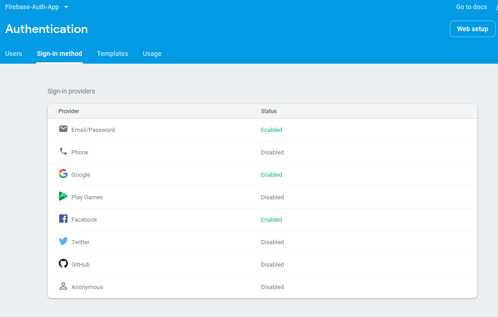
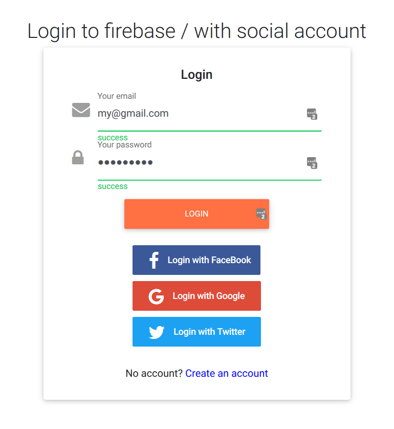
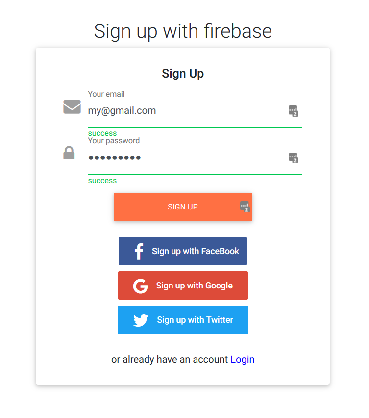
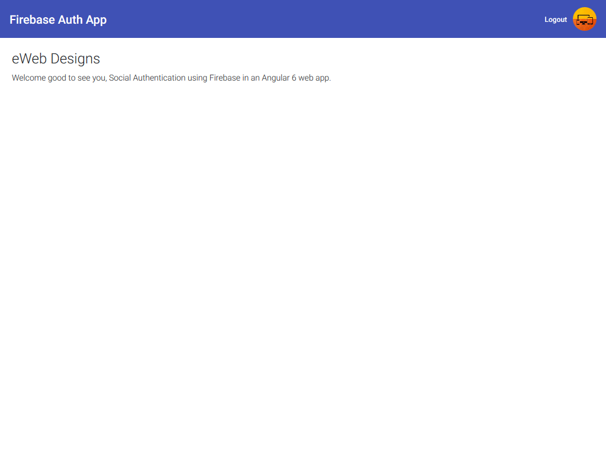

# Firebase Authentication with Angular 6 App

Angular 6 auth app with social authentication login. This project is an updated version from angular-templates, using the AngularFire2 libary and firebase.

## PWA, Angular Material, MD-Bootstrap

This project was generated with [Angular CLI](https://github.com/angular/angular-cli) version 6.1.3.

## Install repository

Run `npm install` to load all the required dependencies

## In your firebase console

### add credentials

```
 export const environment = {
      production: false,
      firebase: {
   apiKey: "YOUR_CREDENTIALS_HERE",
   authDomain: "YOUR_CREDENTIALS_HERE",
   databaseURL: "YOUR_CREDENTIALS_HERE",
   projectId: "YOUR_CREDENTIALS_HERE",
   storageBucket: "YOUR_CREDENTIALS_HERE",
   messagingSenderId: "YOUR_CREDENTIALS_HERE"
 }
};
```

### Enable email and social connects



configure App id and App secret with facebook and twitter.

Now run `ng serve -o` to start your local server.




## When login avatar right of screen and welcome page


